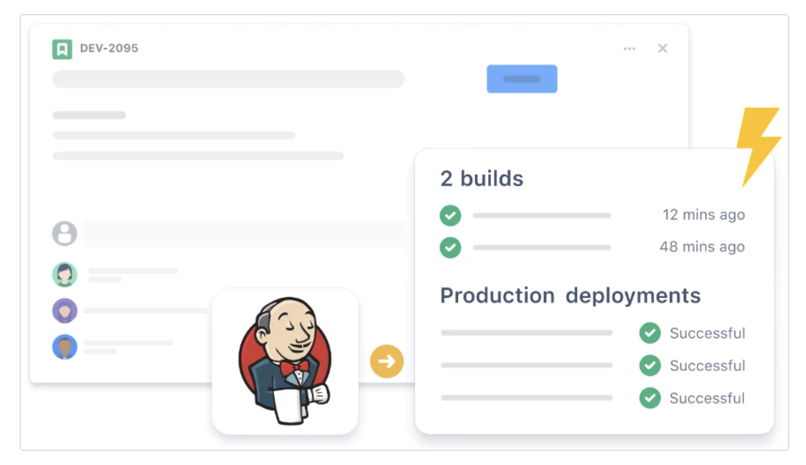
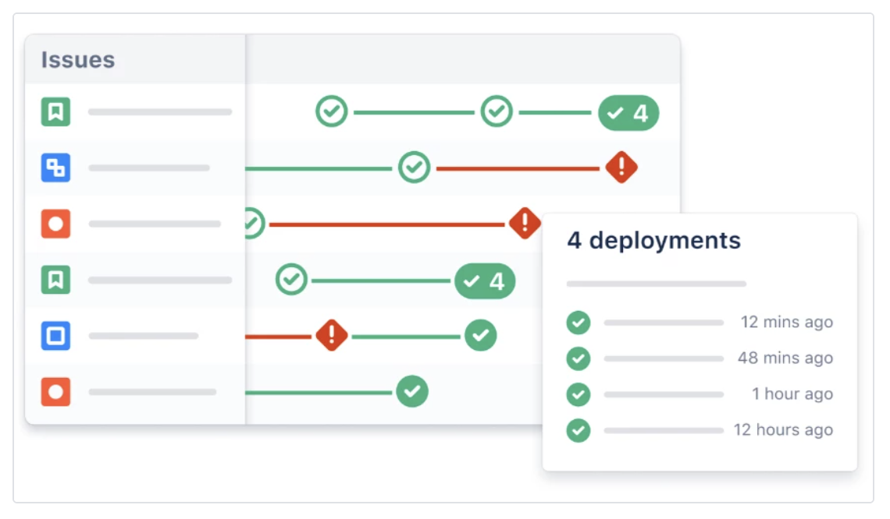
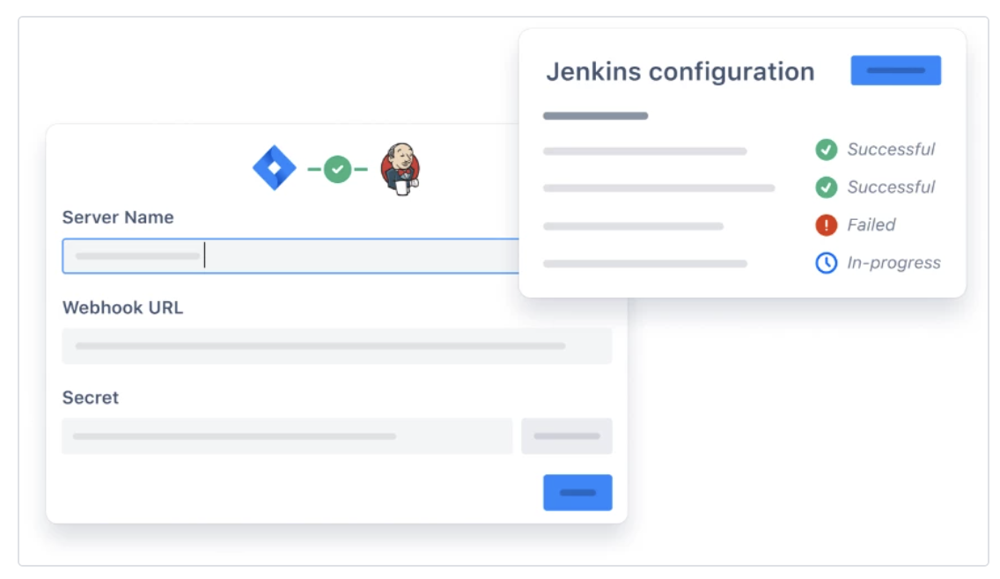
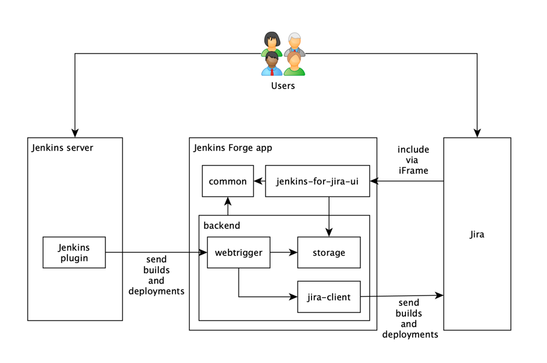

# Jenkins for Jira app

[](LICENSE) [](CONTRIBUTING.md)

Connect your Jenkins server to Jira Software Cloud for more visibility into your development pipeline.


View Jenkins builds and deployments in Jira
Automatically send build and deployment data from Jenkins to Jira Software Cloud so you can see how work is progressing and confirm when features have been shipped.


Track work as it moves through your pipeline
View all your Jenkins deployments on a timeline using the deployments feature. Filter or search to view deployments by environment, assignee, issue type, and more.


Securely connect your self-hosted Jenkins server
Connect your Jenkins server to Jira Software Cloud using a webhook so it can securely send data without the need to open any firewall ports.


> Other recommended badges are a [version](https://shields.io/category/version) badge (e.g. `npm`) and a [build](https://shields.io/category/build) badge (e.g., `circleci` or `travis`). Order should be `license - version - build - PRs`. Please use the `flat-sqare` style.
> 
> See e.g.
> 
> [](https://www.npmjs.com/package/react-beautiful-dnd) [](https://www.npmjs.com/package/@atlaskit/button) [](https://travis-ci.org/stricter/stricter)


## Usage

The app supports all the features of the Atlassian Jenkins plugin. You can read about them [here](https://github.com/jenkinsci/atlassian-jira-software-cloud-plugin).

The main use case is to show information about Jenkins [builds and deployments in Jira](https://www.atlassian.com/solutions/devops/features).

## Documentation

This is an app that you can install into your Jira site to connect it with a Jenkins server. It's built on top of Atlassian's [Forge platform](https://developer.atlassian.com/platform/forge/).

After installing the app, the app will guide you through the process of setting everything up.

### Architecture 

On a high level, the app receives events from the Jenkins plugin, updates internal state, and then forwards them to Jira. The app provides a convenient admin UI to manage the connections to one or more Jenkins servers.



The app provides a [web trigger](https://developer.atlassian.com/platform/forge/manifest-reference/modules/web-trigger/) that acts as the entry point to all requests from the Jenkins plugin.

The web trigger and the Jenkins plugin share a secret that is used by the Jenkins plugin to sign the payload and by the web trigger to verify the signature so that only requests from valid sources are accepted.

On each event, the web trigger updates the internal storage to store information about the latest events and then sends the events to Jira.

The `app/jenkins-for-jira-ui/src` directory contains the UI components and the `app/src` directory contains the backend functions. See [this README](app/README.md) for more information about working with the Forge app.

## Getting Started

### Common Forge commands
There are several Forge CLI commands that need to be run when working with Forge:

- Use the `forge install` command to install the app on a new site.
- Use the `forge tunnel` command to open a HTTP tunnel to your locally running app. It propogates the local version of the app to Jira while the command is running.
- Use the `forge deploy` command to apply and push your changes to the Atlassian cloud. All Jira sites with the Jenkins for Jira app installed will use these deployed changes in the development environment.
- Use the `forge uninstall` command to uninstall the app from your Jira site.
- Use the `forge register` command to generate an app id that you will need to be able to deploy, install and run the app locally.

For more information on running and deploying Forge apps, see [here](https://developer.atlassian.com/platform/forge/build-a-hello-world-app-in-jira/#deploy-app-changes).

### Setting up Forge

> NOTE: This section is only relevant if you've never run Forge commands on your machine.

1. Install the Forge CLI globally by running:
```
npm install -g @forge/cli
```

    If it's been installed correctly, `forge --version` will return the version number.

2. Login to Forge:
```
forge login
```

    If you've logged in correctly, the CLI will return `✔ Logged in as <your name>`.

For more information, see the [Forge getting started page](https://developer.atlassian.com/platform/forge/getting-started/).

### Setting up the Jenkins for Jira app

The app consists of two components:

* the UI in the folder `app/jenkins-for-jira-ui`
* the app itself in the folder `app`.

To get up and running, follow the steps below.

#### Initial Setup

1. Create your `.env` file based on the `.env.example` file in **/app/jenkins-for-jira-ui**.
2. Switch to the correct `node` version. You can run `nvm use` in the folders: **/app/jenkins-for-jira-ui** and **/app**.
3. In the folders **/app** and **/app/jenkins-for-jira-ui**, run `npm install`;

#### Register your Forge app

A Forge app currently can have only a single owner. That means you need to register your own "version" of the app for testing purposes.

Register your own version of the Forge app by calling `forge register` in the **/app** directory. When prompted to add an app name, use any name you want to identify your app with (we recommend the name `jenkins-for-jira-<yourname>`. This will register a new Forge app and update your `manifest.yml` file with your personal app ID.

Because the `manifest.yml` contains the app ID (something like `ari:cloud:ecosystem::app/3446ee2c-f453-4e83-952a-9c15807e5de1`) and each developer has their own app ID, we're using a [Git filter](https://bignerdranch.com/blog/git-smudge-and-clean-filters-making-changes-so-you-dont-have-to/) so we don't accidentally commit a changed app ID.

Add the following content to you `.git/config` file:

```
[filter "setid"]
    clean = sed "s/<YOUR_APP_UUID>/3446ee2c-f453-4e83-952a-9c15807e5de1/g"
    smudge = sed "s/3446ee2c-f453-4e83-952a-9c15807e5de1/<YOUR_APP_UUID>/g"
```

Replace `<YOUR_APP_UUID>` with the UUID part of your APP ID that you can find in your `manifest.yml`. The UUID `344...` is the ID of our "production" app.

The filter `setid` is used in `/app/.gitattributes` so that it replaces your app ID with the ID of our "production" app every time you commit and and the other way around every time you pull, so that you can't accidentally commit your own app ID.

#### Install the app to your Jira instance

1. Build your app by running `npm run build` in **/app/jenkins-for-jira-ui**.
2. Deploy your app by running `forge deploy` in **/app**.
3. Install your app to your Jira site by running `forge install` in **/app**.

Follow the instructions in this set up wizard. Enter the hostname for your Jira site (e.g. `<your-site-name>.atlassian.net`).

> NOTE: This is the *only* step that needs to be repeated to install on different Jira sites. Do not repeat the steps above `forge deploy`. To run your app, follow the steps below.

## Running the app
To run the app, ensure you have installed the app on your site as described above.

### Run the app locally

To start the app locally, run `npm run start` in **/app/jenkins-for-jira-ui**.

The command line will suggest navigating to `localhost:3000` but this does not work for `Custom UI` Forge apps. For more information, see [here](https://community.developer.atlassian.com/t/forge-tunneling-customui-with-ui-resolver-error-cannot-read-property-callbridge-of-undefined/47010/3).

To see your local app in the Jira instance you installed the app into, run `forge tunnel` in the **/app** folder.

All your changes are instantly propagated to your Jira and you can see them without the need to rebuild or redeploy your app.

To find your app, go to the `Manage apps` page (`https://<your-site-name>.atlassian.net/plugins/servlet/upm`) then click the `Jenkins for Jira` link in the left-hand panel.

### Deploy changes to the app

To push your latest local changes to the Atlassian cloud, run the following commands:

1. In **/app/jenkins-for-jira-ui** run `npm run build`.
2. In **/app**, run `forge deploy`.

Doing this, your local changes will be propagated to **all Jira sites that have the app installed** (unless one runs `forge tunnel`, as that will take priority).


## Tests

In the **/app/jenkins-for-jira-ui** dir, run `npm test`.

## Contributions

Contributions to Jenkins for Jira are welcome! Please see [CONTRIBUTING.md](CONTRIBUTING.md) for details. 

If you have feedback regarding this app, feel free to raise issues in this repository. 

## License

Copyright (c) 2022 Atlassian and others.
Apache 2.0 licensed, see [LICENSE](LICENSE) file.

<br/> 


[](https://www.atlassian.com)
